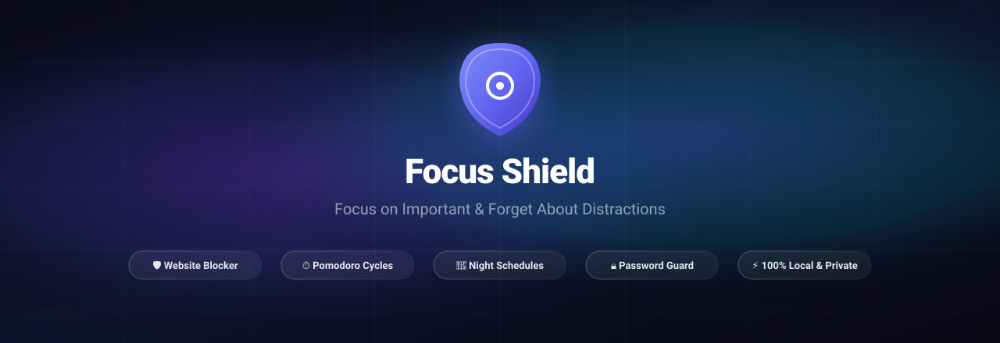
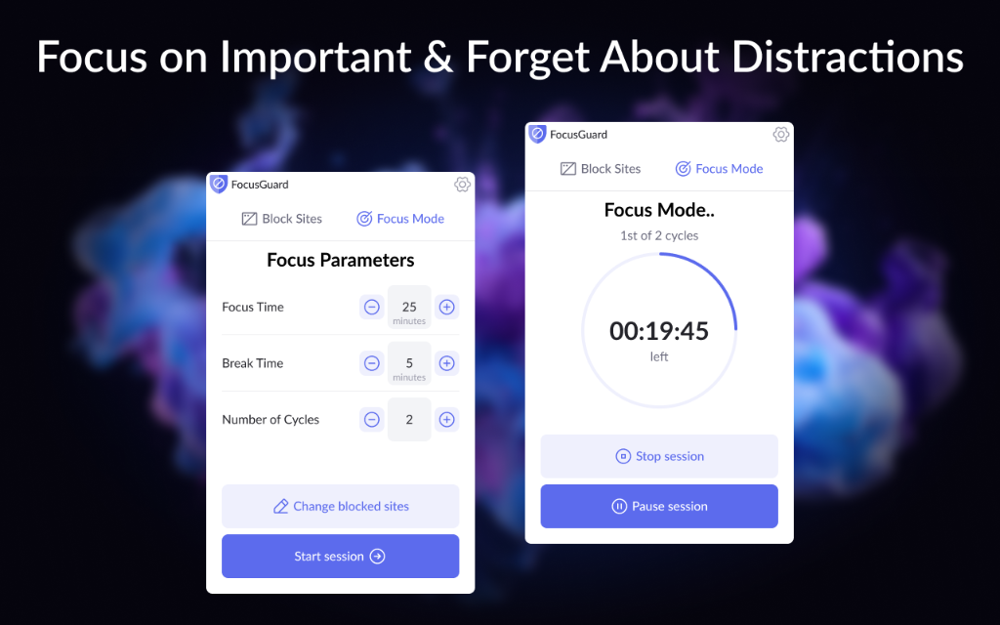
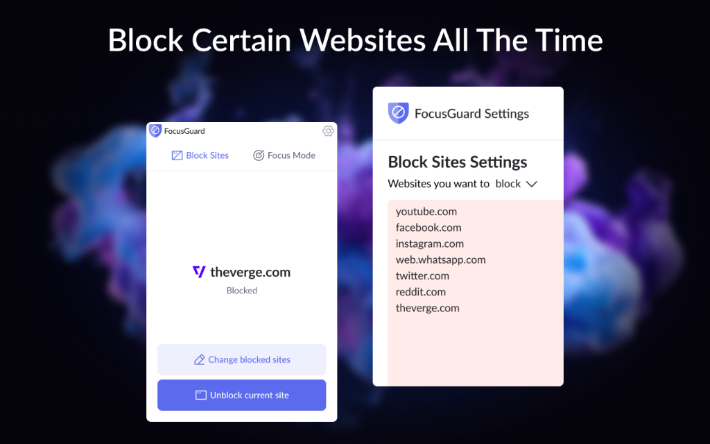
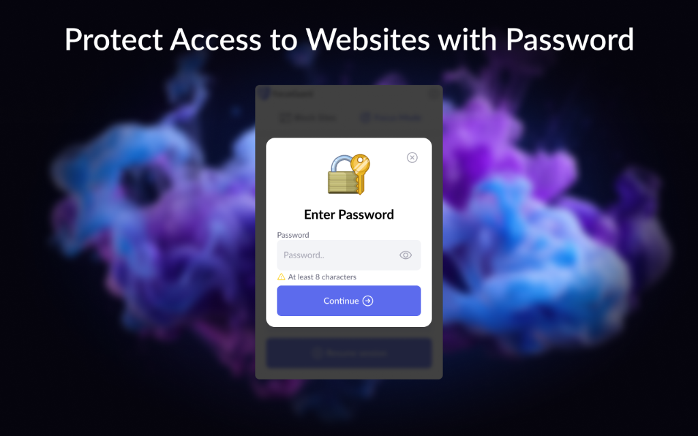

# Focus Shield — Website Blocker, Pomodoro Focus Sessions & Habit Guard

<div align="center">

[](https://chrome.google.com/webstore)
[](https://developer.chrome.com/docs/extensions/mv3/intro/)
[](https://react.dev/)
[](https://vitejs.dev/)
[](tests/)
[](LICENSE)
[](#-privacy--security)

---

### Fast, lightweight, and 100% private in-browser Chrome extension for domain & keyword blocking, Pomodoro focus sessions, overnight schedules, and encrypted password security.

</div>

<br />

<p align="center">
  
</p>

<br />

---

## 📸 Visual Walkthrough & Screenshots

### 1. Focus Mode & Pomodoro Cycles Timer

Customizable work and break intervals with multi-cycle Pomodoro support, animated circular SVG countdown timer, and strict focus enforcement.

<p align="center">
  
</p>

---

### 2. Block Distracting Websites & Settings Hub

Instant current-site blocking from the popup, automatic domain & subdomain matching, keyword URL filters, exception allowlist, and quick pause durations.

<p align="center">
  
</p>

---

### 3. Encrypted Master Password Protection

Hardware-grade Web Crypto PBKDF2 SHA-256 encryption prevents accidental unblocking, rule deletion, or disabling during focus periods, backed by temporary 5-minute session unlocking.

<p align="center">
  
</p>

---

## 🚀 Key Highlights & Capabilities

- 🛡️ **Declarative Net Request (DNR) Engine**: Modern Manifest V3 network blocking via Chrome's native Declarative Net Request API. Dynamic rules for permanent blocks and session rules for temporary focus periods with redirect to a clean custom `blocked.html` page.
- ⏱️ **Full Pomodoro Focus Cycles**: Flexible session parameters with work time (5–180 min), break time (0–60 min), and cycle counts (1–12). Smooth animated SVG circular countdown ring with real-time remaining time display.
- 🔒 **Strict Focus Mode (Opt-In)**: Once activated, prevents stopping sessions early or tampering with blocked website lists until the timer runs out.
- 🌙 **Overnight Schedule Intervals**: Full support for daytime and overnight blocking intervals crossing midnight (e.g. `22:00` to `07:00`) with automatic next-boundary alarm recalculation.
- ⏸️ **Granular Pause Controls**: Temporarily suspend blocking rules for 5m, 15m, 30m, 1h, or until manually resumed without losing configuration.
- 🔑 **Zero-Plaintext Web Crypto Security**: Passwords are never stored in cleartext. Derived using PBKDF2 (SHA-256, 100,000 iterations, 16-byte cryptographic salt). Temporary 5-minute unlock is held in ephemeral `chrome.storage.session`.
- 💾 **Local Backup & Restore (JSON)**: Export your full configuration to `focus-shield-backup-YYYY-MM-DD.json`. Import with schema validation (up to 5 MB), duplicate skipping (Merge mode), or complete replacement with password verification.
- 🌍 **Multilingual by Design (i18n)**: Fully localized in English, Russian, and Ukrainian with instant runtime switching without page reloads.
- ⚡ **100% Local & Privacy-First**: Operates strictly within your browser. No external backend servers, no cloud sync, no tracking, and zero telemetry.

---

## 📂 Feature & Tool Matrix

| Module / Tool | Core Functionality | Rules & Scope |
| :--- | :--- | :--- |
| **Block Sites Popup** | Current tab detection, 1-click domain block, master toggle, pause menu | `chrome.declarativeNetRequest`, `activeTab` |
| **Focus Mode Studio** | Pomodoro cycles, circular countdown timer, work/break phase switching | `updateSessionRules`, `chrome.alarms` |
| **Blocked Sites Manager** | Domain, Path (`domain.com/path*`), and Keyword (`*keyword*`) filters | Dynamic DNR rules (`100000–199999`) |
| **Exceptions (Allow List)** | High-priority allow rules to access study/work pages on blocked domains | High priority allow rules (`300000–399999`) |
| **Automated Schedules** | Day-of-week selection, custom timeframes, overnight past-midnight intervals | Boundary alarms (`200000–299999`) |
| **Password Security** | Web Crypto PBKDF2 SHA-256, 100k iterations, 5-minute temporary session unlock | `chrome.storage.session` memory cache |
| **Backup & Restore** | Export & import JSON backups with schema validation, deduplication, rollback | Local file download (`<a download>`) |
| **Custom Blocked Page** | Friendly blocking screen with domain info, countdown, custom motivational text | Web-accessible local `blocked.html` |
| **i18n Language Switcher** | Runtime translation engine supporting English, Russian, and Ukrainian | Local dictionary JSON files |

---

## 🔒 Privacy & Security

Focus Shield is built with an uncompromising **Privacy-First** standard:

1. **100% Client-Side Processing**: All blocking rules, schedules, and timer calculations run locally inside Chrome's Manifest V3 sandbox.
2. **Zero Remote Servers & Zero Telemetry**: The extension contains no analytics, no trackers, and makes zero network requests.
3. **No Account Required**: Ready to use immediately upon installation without registration or login.
4. **No Cloud Sync (`chrome.storage.sync` strictly disabled)**: All settings, lists, and schedules are stored exclusively on your device using `chrome.storage.local`.
5. **Safe Credential Handling**: Password hashes and salts are excluded from export backups to prevent offline cracking.

---

## 🛠️ Architecture & Tech Stack

- **Manifest V3**: Modular Service Worker (`src/background/service-worker.js`) with event-driven lifecycle.
- **React 19 & Vite 6**: Lightning-fast compilation and multi-page HTML entrypoints (`popup.html`, `settings.html`, `blocked.html`).
- **Declarative Net Request (DNR)**: Native browser request redirection without blocking web requests.
- **Lucide Icons**: Crisp, modern iconography.
- **Vitest 3**: 32 unit tests verifying core business logic.

```text
focus-shield-chrome-extension/
├── public/
│   ├── manifest.json              # Manifest V3 extension configuration
│   ├── icons/                     # Generated extension icons (16, 32, 48, 128px)
│   └── _locales/                  # Web Store manifest localizations (en, ru, uk)
├── src/
│   ├── background/
│   │   ├── service-worker.js      # Background worker (alarms, lifecycle, messages)
│   │   ├── bootstrap.js           # Startup recovery & state migration
│   │   ├── messageRouter.js       # Popup & settings runtime communication
│   │   └── badgeController.js     # Toolbar badge indicators (F/P/OFF)
│   ├── blocking/
│   │   ├── domainParser.js        # Domain normalization & URL keyword parser
│   │   ├── ruleBuilder.js         # Declarative Net Request (DNR) rule compiler
│   │   ├── ruleIdAllocator.js     # Deterministic rule ID range allocator
│   │   ├── rulePriorities.js      # Priority hierarchy (Allow > Strict > Focus > Base)
│   │   └── ruleReconciler.js      # Core DNR state synchronization engine
│   ├── schedules/
│   │   ├── scheduleEvaluator.js   # Schedule logic with overnight interval support
│   │   ├── nextBoundary.js        # Schedule transition boundary calculator
│   │   └── alarmManager.js        # Chrome alarms scheduler
│   ├── focus/
│   │   └── focusService.js        # Pomodoro session state machine & timer
│   ├── pause/
│   │   └── pauseService.js        # Temporary blocking suspension manager
│   ├── security/
│   │   ├── crypto.js              # Web Crypto PBKDF2 SHA-256 password hasher
│   │   ├── passwordService.js     # Password verification & protection rules
│   │   └── unlockSession.js       # Ephemeral 5-minute session unlock cache
│   ├── storage/
│   │   ├── defaults.js            # Initial configuration state
│   │   ├── schema.js              # State schema validation
│   │   ├── settingsRepository.js  # chrome.storage.local repository layer
│   │   └── migrations/            # Versioned state migrations
│   ├── backup/
│   │   ├── exportSettings.js      # JSON backup exporter & file downloader
│   │   ├── validateBackup.js      # Backup schema & size validator (5 MB)
│   │   ├── mergeBackup.js         # Intelligent deduplicated merge engine
│   │   └── importSettings.js      # Atomic import applicator with rollback
│   ├── i18n/
│   │   ├── index.js               # React i18n provider & hook
│   │   ├── en.json                # English dictionary
│   │   ├── ru.json                # Russian dictionary
│   │   └── uk.json                # Ukrainian dictionary
│   ├── components/                # Reusable UI components (Header, Timer, Modals)
│   ├── popup/                     # Popup React application
│   ├── settings/                  # Full Settings & Dashboard React application
│   ├── blocked/                   # Custom Blocked Page application
│   └── shared/                    # Constants & shared utilities
├── assets/
│   ├── banner.svg                 # Project hero banner
│   └── screenshots/               # Application UI walkthrough screenshots
├── scripts/
│   ├── generate-banner.js         # SVG hero banner generator
│   ├── generate-icons.js          # Raw PNG icon generator
│   ├── postbuild.js               # Build output validation
│   └── package.js                 # Production zip packager
├── tests/                         # 32 Vitest unit tests
└── store/                         # Chrome Web Store submission materials
```

---

## 💻 Development & Build Instructions

### Prerequisites

- **Node.js** >= 18.0.0 (tested on Node.js 22)
- **npm** >= 9.0.0

### 1. Clone & Install

```bash
git clone https://github.com/Solod-S/focus-shield-chrome-extension.git
cd focus-shield-chrome-extension
npm install
```

### 2. Run Tests

```bash
npm test
```

Runs all 32 unit tests with Vitest in jsdom environment:

```text
 ✓ tests/pauseService.test.js (3 tests)
 ✓ tests/scheduleEvaluator.test.js (3 tests)
 ✓ tests/focusService.test.js (4 tests)
 ✓ tests/ruleBuilder.test.js (4 tests)
 ✓ tests/domainParser.test.js (5 tests)
 ✓ tests/ruleReconciler.test.js (4 tests)
 ✓ tests/i18n.test.js (3 tests)
 ✓ tests/backup.test.js (3 tests)
 ✓ tests/crypto.test.js (3 tests)

 Test Files  9 passed (9)
      Tests  32 passed (32)
```

### 3. Build Production Extension

```bash
npm run build
```

Compiles all React pages and Service Worker into `dist/`.

### 4. Create Release Archive

```bash
npm run package
```

Produces ready-to-publish zip archives in `release/focus-shield-v1.0.0.zip`.

---

## 🚀 Loading Unpacked Extension into Chrome

1. Open Google Chrome and navigate to `chrome://extensions/`.
2. Enable the **Developer mode** toggle in the top-right corner.
3. Click the **Load unpacked** button in the top-left corner.
4. Select the `dist/` directory inside this project folder.
5. The **Focus Shield** icon will appear in your Chrome toolbar. Pin it for instant access!

---

## 📄 License

This project is open-source and licensed under the [MIT License](LICENSE).
